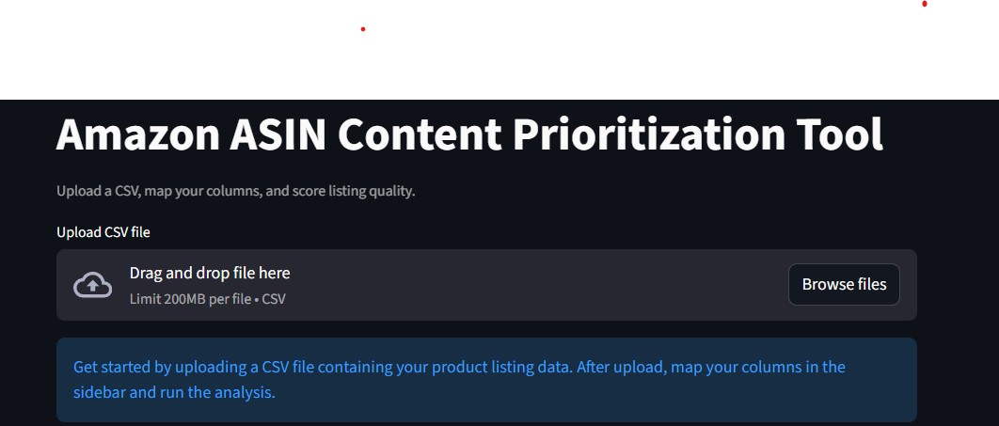
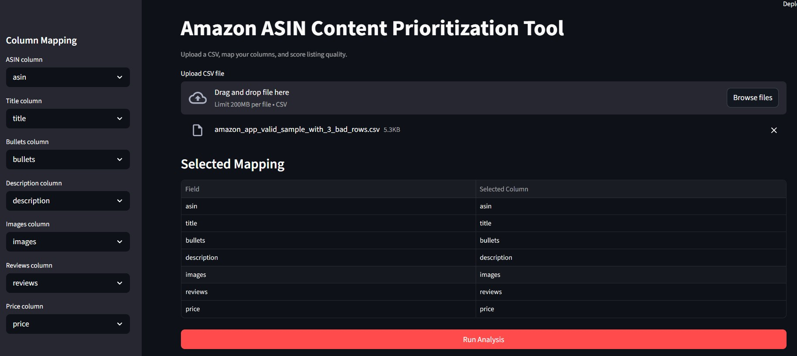
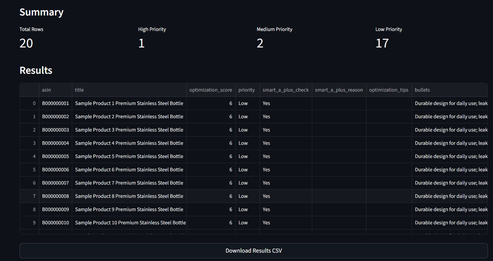

# Amazon ASIN Content Prioritization Tool

A Streamlit MVP app that analyzes product listing data from a CSV file and helps identify which ASINs need optimization first.

## Overview

This tool is designed for ecommerce and marketplace workflows where product data is often exported from Amazon, ERP, or ecommerce systems and reviewed in bulk.

The app allows a user to:

1. Upload a CSV file
2. Map the required columns
3. Run listing analysis
4. Review optimization scores and priority levels
5. Export the results as a CSV file

## Screenshots

### Default


### App Upload and Column Mapping


### Analysis Results and Summary


## Features

- CSV upload
- Manual column mapping
- Rule-based optimization scoring
- Smart A+ quality check
- Optimization tips for each row
- Summary metrics:
  - Total rows
  - High priority count
  - Medium priority count
  - Low priority count
- CSV export for further action

## How It Works

After a CSV file is uploaded, the app uses mapped columns to evaluate each product listing.

### Scoring Checks

Each row is scored based on the following rules:

1. Title length is at least 20 characters
2. Bullets length is at least 30 characters
3. Description length is at least 40 characters
4. Image count is at least 5
5. Review count is at least 10
6. Price is greater than 0

### Priority Rules

1. 5 to 6 points = Low priority
2. 3 to 4 points = Medium priority
3. 0 to 2 points = High priority

## Smart A+ Check

The app includes a custom `smart_a_plus_check` field based on listing completeness signals.

A row fails the smart A+ check if any of the following are true:

1. Title is too short
2. Bullets are missing or weak
3. Description is missing
4. Fewer than 5 images
5. No product reviews

The app outputs:

- `smart_a_plus_check`
- `smart_a_plus_reason`

## Expected Input

The app works best with CSV files containing columns related to:

1. ASIN
2. Title
3. Bullets
4. Description
5. Images
6. Reviews
7. Price

The exact header names do not need to match because the user selects the correct columns in the sidebar.

## Getting Started

### 1. Clone the repository

```bash
git clone https://github.com/rkhloy/asin-aplus-prioritizer.git
cd asin-aplus-prioritizer

```

2. Install requirements
pip install -r requirements.txt

3. Run the app
streamlit run app.py

Example Workflow
Upload a product data CSV
Select the correct ASIN, title, bullets, description, images, reviews, and price columns
Click Run Analysis
Review the summary metrics
Download the results CSV

Sample Input Columns

Example headers the app can work with after manual mapping:

asin,title,bullets,description,images,reviews,price

Output Columns

The output file includes the original input data plus analysis fields such as:

optimization_score
priority
smart_a_plus_check
smart_a_plus_reason
optimization_tips

Project Structure
asin-aplus-prioritizer/
├── app.py
├── README.md
├── requirements.txt
├── sample_data/
└── screenshots/

Use Cases

Prioritize Amazon listings that need content improvement
Review exported marketplace product files in bulk
Identify weak listings before optimization work begins
Create a simple action file for ecommerce content updates

Future Improvements
Add SKU support
Add weighted scoring controls
Add charts for priority distribution
Add better validation for duplicate mapping
Add sorting and filtering options
Add support for multiple export views

Tech Stack
Python
Streamlit
Pandas

Notes
This is an MVP tool built with rule-based logic. The smart_a_plus_check field is a custom internal quality check and does not verify live Amazon A+ status directly.